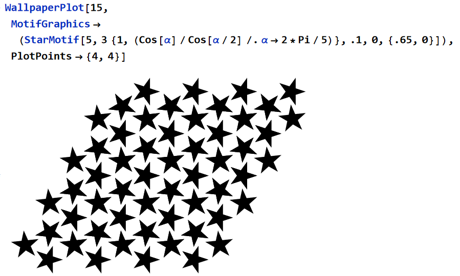
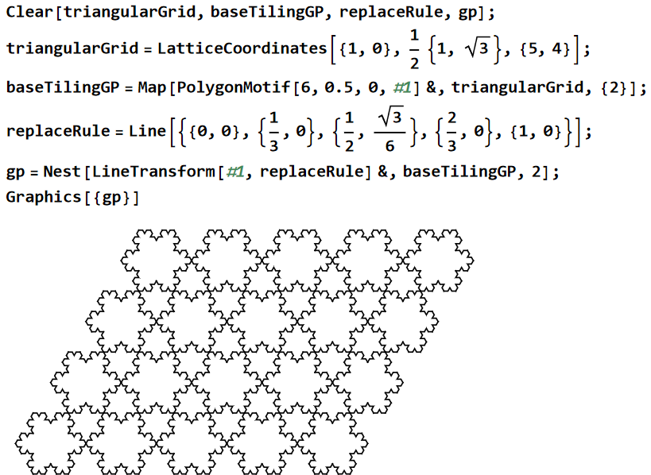

PlaneTiling.wl is a package for Wolfram language / Mathematica for generating all possible wallpaper designs, periodic tilings, plane group symmetry illustrations.

PlaneTiling.wl
is the code.

PlaneTilingDoc.nb
is the documentation.

all exported symbols are fully documented. e.g.
Type
?name
for documentation.

open
PlaneTilingDoc.nb
to start.

Home page url:
http://xahlee.info/MathGraphicsGallery_dir/PlaneTilingPackageDemo_dir/planeTilingPackageDemo.html

This package is sponsored by Wolfram Research.

# gallery

